<!-- CureQ logo -->

# CureQ-Lab

Welcome to the CureQ Lab main page!

In the CureQ Lab, we develop tools to analyse biological data.

This repository contains [libraries for the CureQ consortium](#cureq-projects) and [research projects of the AUAS CureQ Lab](#other-auas-projects), which are developed as part of the Applied Artificial Intelligence (AI) master thesis and the Biomedical Engineering (BMT) bachelor thesis at the Amsterdam University of Applied Sciences (HvA).

Furthermore, students from the Master of Applied Artificial Intelligence completed an [AI-Lab assignment](#ai-lab-assignments) to design and develop smart and affordable solutions for healthcare with Edge technology (Tiny Machine Learning). These solutions with associated User Manuals can be integrated into educational teaching.

1. [CureQ projects](#cureq-projects)
2. [CureQ Lab projects](#other-auas-projects)
3. [AI-Lab assignment](#ai-lab-assignments)

## CureQ projects

We have made <i>2</i> GUI's for projects regarding the CureQ consortium. 
1. The [MEAlytics GUI](#mealytics) performs analysis of the Micro-electrode Array (MEA) experiments.
2. The [Microscopy GUI](#microscopy) performs analysis of microscopy images.  

---

  

### MEAlytics

[MEAlytics](https://github.com/CureQ/CureQ) is a python package for analyzing Micro-electrode Array (MEA) experiments. MEA experiments measure the electrical activity of neuron cells through dozens of electrodes simultaneously. The MEAlytics package offers high speed spike, burst and network burst detection followed by feature extraction.  The whole analysis tool is implemented in a Graphical User Interface (GUI). This GUI is used to inspect the raw MEA data and the analysis results. A few examples about the spike detection, burst detection and feature extraction can be found below &darr;

<!-- MEAlytics images -->
<!-- Table Image styling for multiple images near eachother -->
<table>
  <tr>
    <td align="center" width=50%>
      
       
      MEAlytics - Spike Detection
    </td>
    <td align="center" width=50%>
      
       
      MEAlytics - Network Burst Detection
    </td>
  </tr>
</table>

<table>
  <tr>
    <td align="center" width=50%>
      
       
      MEAlytics - Group Comparison
    </td>
    <td align="center" width=50%>
      
       
      MEAlytics - Features over Time
    </td>
  </tr>
</table>

The MEAlytics tool also has a few other extensions (branches), which has not yet been merged with the main branch. These projects are about a newly introduced [Synchronisation method](#synchronisation) and a [Spike heatmap & Machine Learning predictions](#spike-heatmap--machine-learning-predictions).

---

### Synchronisation

An extra feature for the MEAlytics tool is about [Synchronisation](https://github.com/CureQ/CureQ/tree/Luca_synchronisation) methods. Synchrony is the degree of connectivity between two electrodes based on how synchronized the activity is across these electrodes. Synchrony differs from the already existing <i>network bursts</i> feature from the MEAlytics tool, because the <i>network bursts</i> feature requires at least half of the electrodes in a well to be active and the network burst detection is often delayed or absent because of this strict requirement. 

A spike train is a sequence of all detected spikes from an electrode. Examples of two spike trains and the Inter Spike Interval between these two spike trains can be found in the images below &darr;

<!-- Synchrony explanation images -->
<!-- Table Image styling for multiple images near eachother -->
<table>
  <tr>
    <td align="center" width=50%>
      
       
      Synchronicity - Synthetic Spike trains
    </td>
    <td align="center" width=50%>
      
       
      Synchronicity - ISI over time
    </td>
  </tr>
</table>

---

### Spike heatmap & Machine Learning predictions

An other project for the MEAlytics tool consisted of the 2 features: [Spike heatmap & Machine Learning predictions](https://github.com/CureQ/CureQ/tree/Lucas). 

1. The [Spike heatmap frame](https://github.com/CureQ/CureQ/blob/Lucas/docs/heatmap.md) generates an animation of a well overview heatmap with the activity of each electrode. It is also possible to show a heatmap showing the total activity of each electrode, and a heatmap showing the maximum per second activity of each electrode.

<!-- Heatmap images -->
<!-- Table Image styling for multiple images near eachother -->
<table>
  <tr>
    <td align="center" width=49.2%>
      <a href="https://github.com/CureQ/CureQ/blob/Lucas/docs/heatmap.md">
        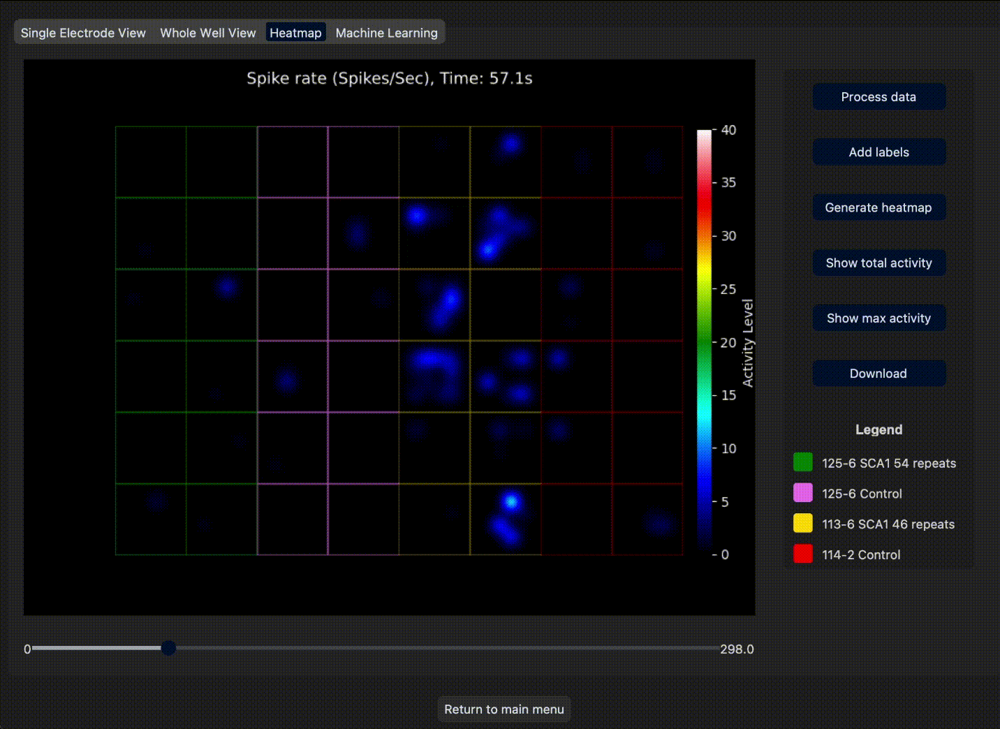
      </a>
       
      Heatmap animation - Activity of each electrode
    </td>
    <td align="center" width=50%>
      
       
      Heatmap - Total activity of each electrode
    </td>
  </tr>
</table>

 

2. There is also a second added frame in this branch, which is about the [Machine Learning predictions](https://github.com/CureQ/CureQ/tree/Lucas).

<!-- Microscopy images -->
<!-- Table Image styling for multiple images near eachother -->
<table>
  <tr>
    <td align="center" width=50%>
      <a href="https://github.com/CureQ/CureQ/tree/Lucas">
        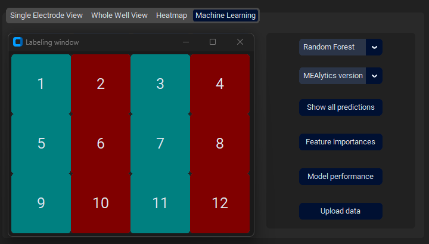
      </a>
       
      Machine Learning Frame
    </td>
    <td align="center" width=50%>
      <a href="https://github.com/CureQ/CureQ/tree/Lucas">
        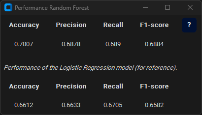
      </a>
       
      Machine Learning Performances
    </td>
  </tr>
</table>

---

### Microscopy 

The [Microscopy GUI](https://github.com/CureQ/Microscopy) performs segmentation and statistical calculations on microscopy images.  The current main version provides the cell body detection application to analyze microscopy images and identify cell bodies in the provided samples.

This project focuses on the selection and implementation of a suitable cell segmentation model for use
 within the CureQ-Toolbox, an analysis tool for microscopy
images in the context of Huntington's disease research. The goal
 was to evaluate the accuracy and usability of various
 segmentation approaches and integrate a model
 that meets the needs of end users. The
 results show that the Cellpose-SAM model, combined
 with a preset diameter parameter, provides the best performance
 in terms of segmentation quality and ease of use.
 The model is locally deployable, requires no additional training and has
 been successfully integrated into a desktop application with a graphical
 user interface. This provides an efficient alternative
to existing manual workflows, supporting the analysis of
 microscopic data within the CureQ consortium.

<!-- Microscopy GUI images -->
<!-- Table Image styling for multiple images near eachother -->
<table>
  <tr>
    <td align="center" width=50%>
      
       
      Microscopy GUI - Loaded microscopy image
    </td>
    <td align="center" width=50%>
      
       
      Microscopy GUI - Segmentated cell bodies
    </td>
  </tr>
</table>

The Microscopy tool also has a few other brances, which has not yet been merged with the main branch. These projects are about [Aggregate quantification](#aggregate-quantification) and [Colocalization](#colocalization).

---

### Aggregate quantification

The [Aggregate quantification](https://github.com/CureQ/Microscopy/tree/Aggregate_Detection/Aggregate_Detection) project presents an image
 processing-based methodology for the segmentation and quantification of neural aggregates in microscopy images of HD-affected
 cells. First, cell structures are segmented using advanced image
 analysis techniques. Then, neural aggregates are identified by applying a predefined intensity threshold and evaluating their size,
 position, and count. The proposed approach enables automated,
 reproducible quantification of neural aggregates and provides a
 practical tool for analyzing cellular phenotypes associated with
 HD.

  <a href="https://github.com/CureQ/Microscopy/tree/Aggregate_Detection/Aggregate_Detection">
    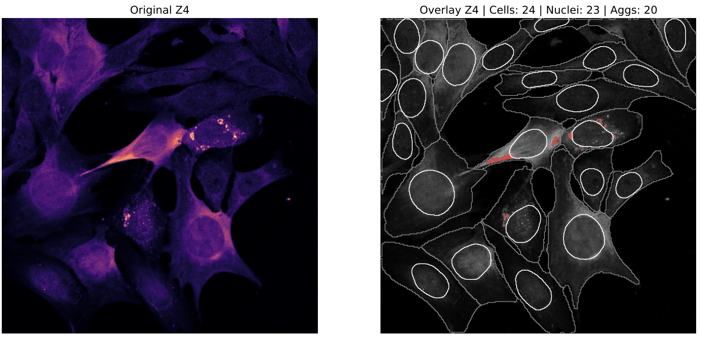
  </a>
   
  Microscopy GUI - Aggregate Quantification of 2D Microscopy Image

---

### Colocalization

The [Colocalization](https://github.com/CureQ/Microscopy/tree/Colocalization/Colocalization) project presents an automated pipeline to quantify and
 map colocalization between themolecular chaperone CCT1
 and mutant Huntingtin (mHTT) aggregates in 3D fluorescence
 microscopy images. Robust spatial quantification of CCT1
 at mHTT inclusions has previously been lacking, limiting
systematic analysis of CCT1–mHTT colocalization. To address this, a transparent, GUI-driven pipeline was developed
 that combines statistical segmentation with intensity-based
 enrichment analysis. The pipeline processes multi-channel z-stack images, segments mHTT aggregates using voxel-based
 masks, and quantifies the spatial relationship between CCT1
 and mHTT through complementary colocalization and enrichment metrics. Validation was performed on expert-annotated
 microscopy data, with visual overlays ensuring biological
 plausibility of automated outputs. Results suggest a significant enrichment of CCT1 at mHTT aggregation sites in
 the analyzed dataset. The pipeline produces reproducible and
 interpretable outputs, providing a flexible and user-friendly
 alternative to previously manual, labor-intensive, and subjective workflows. Its modular architecture supports integration
 of future AI models and enables scalable, high-throughput
 analysis of CCT1–mHTT interactions in evolving microscopy
 datasets.

  <a href="https://github.com/CureQ/Microscopy/tree/Colocalization/Colocalization">
    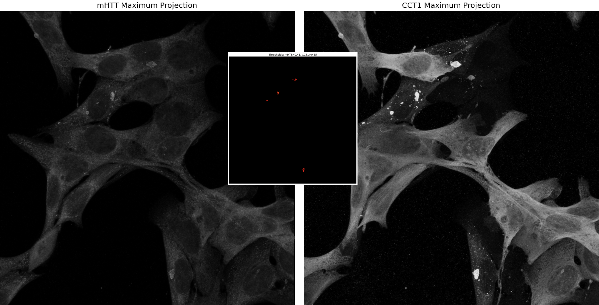
  </a>
   
  Microscopy GUI - Colocalization between mHTT and CCT1

---

## Other AUAS projects

In our CureQ lab at the Amsterdam University of Applied Sciences (AUAS), we also have had some other projects, which are not CureQ related, but do have a subject relating to <i>Biomedical Technology</i> and <i>Artificial Intelligence (AI)</i>. These <i>4</i> projects are listed below.

1. [Cardiovascular Risk](#cardiovascular-risk)
2. [HybriCheX](#hybrichex)
3. [Low Light Image Enhancement](#low-light-image-enhancement)
4. [Sleepscore](#sleeping-score)

---

### Cardiovascular Risk

The [Cardiovascular Risk](https://github.com/CureQ/Cardiovascular-Risk) project focuses on developing an explainable AI
 tool to predict individual cardiovascular disease (CVD) risk based
 on clinical data, designed for use in the Health Checkpoints
 (HCPs) initiative in Amsterdam. Using the Cleveland dataset,
 multiple machine learning models were evaluated. Logistic regression achieved the best performance (ROC AUC = 0.936,
 recall = 0.81) and offered the highest interpretability for practical
 deployment. SHAP analysis revealed that dynamic stress related
 variables, such as ST depression (oldpeak), exercise induced
 angina (exang), and chest pain type, were the most influential predictors, surpassing traditional risk factors like age and
 cholesterol. The prototype was co designed with health students
 and integrates into existing workflows, enabling fast, transparent
 risk feedback. This study demonstrates that explainable AI is
 both feasible and valuable in community-based preventive care,
 provided it is user-centered and embedded in responsible human
 oversight.

<!-- Cardiovascular Risk images -->
<!-- Table Image styling for multiple images near eachother -->
<table>
  <tr>
    <td align="center" width=50%>
      <a href="https://github.com/CureQ/Cardiovascular-Risk">
        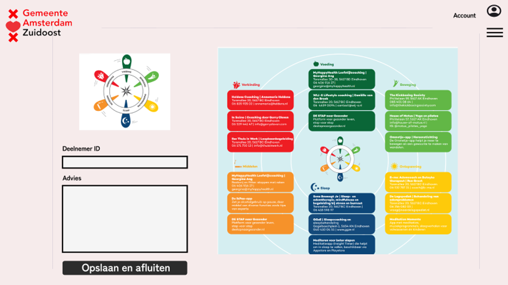
      </a>
       
      Cardiovascular Risks - Advice card for Healthier Life
    </td>
    <td align="center" width=50%>
      <a href="https://github.com/CureQ/Cardiovascular-Risk">
        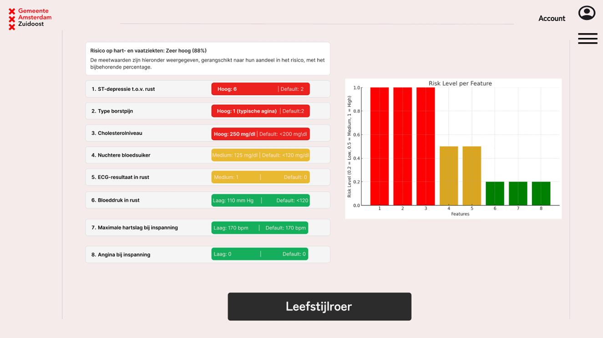
      </a>
       
      Risks on Cardiovascular Diseases
    </td>
  </tr>
</table>

---

### HybriCheX

Chest X-ray (CXR) imaging is a widely used diagnostic tool for detecting thoracic pathologies. However, in
terpretation remains challenging due to subtle abnormalities
 or variability in anatomical structures leading to potential
 perceptual and cognitive errors by radiologists. Deep learning models, particularly Convolutional Neural Networks, have
 demonstrated strong performance in automated Chest X-ray
 analysis. While Convolutional Neural Networks excel at local
 feature extraction, they lack a holistic understanding of the entire
 image, limiting their effectiveness in comprehensive diagnosis.
 Vision Transformers offer a solution by leveraging self-attention
 mechanisms to analyze both local and global image contexts.
 However, traditional Vision Transformers face limitations, for
 example their fixed patch sizes, which may lead to suboptimal
 feature representation. 
 
 The [HybriCheX](https://github.com/CureQ/HybriChex) project investigates the effectiveness of
 a hybrid CNN-Swin Transformer model for thoracic pathology
 classification. The proposed approach combines the strengths
 of CheXNet, a CNN-based model, for local feature extraction
 and the Swin Transformer based on the SwinCheX architecture
 for hierarchical global context analysis. The model is evaluated
 against the existing hybrid CNN-ViT model CheXViT, which uses
 a regular Vision Transformer instead of a Swin Transformer.
 The goal is to determine whether the incorporation of a Swin
 Transformer improves classification performance. Key factors
 such as dataset selection, model optimization, explainability,
 computational efficiency, and integration into a user-friendly
 interface are explored. The research aims to provide insights
 into the advantages of a hybrid approach in medical CXR image
 analysis, balancing computational efficiency with diagnostic accuracy. Findings from this study can contribute to the development
 of robust AI-assisted diagnostic tools, potentially improving
 clinical decision-making and reducing radiologic errors in CXR
 interpretation.

<!-- HybriCheX images -->
<!-- Table Image styling for multiple images near eachother -->
<table>
  <tr>
    <td align="center" width=50%>
      <a href="https://github.com/CureQ/HybriChex">
        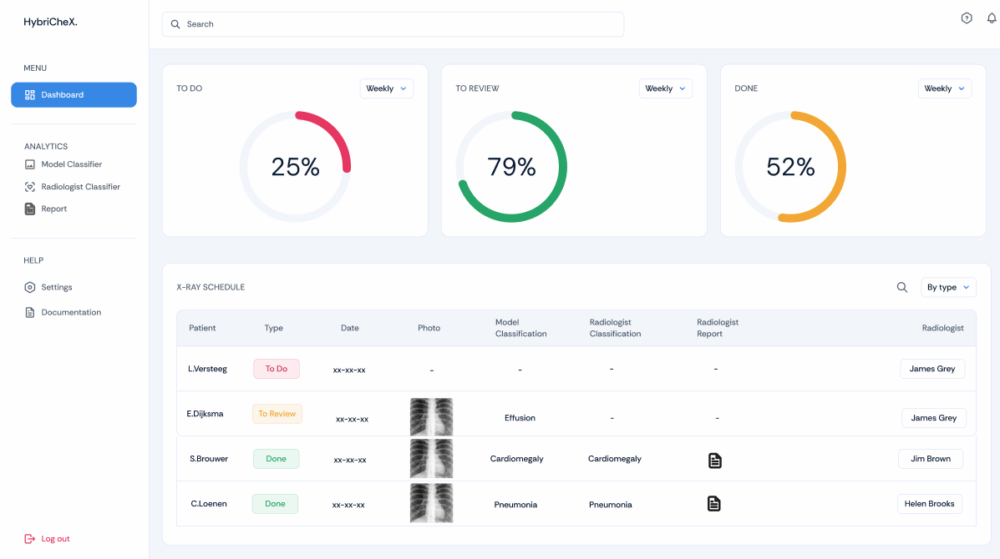
      </a>
       
      HybriCheX - Dashboard for Radiologists
    </td>
    <td align="center" width=50%>
      <a href="https://github.com/CureQ/HybriChex">
        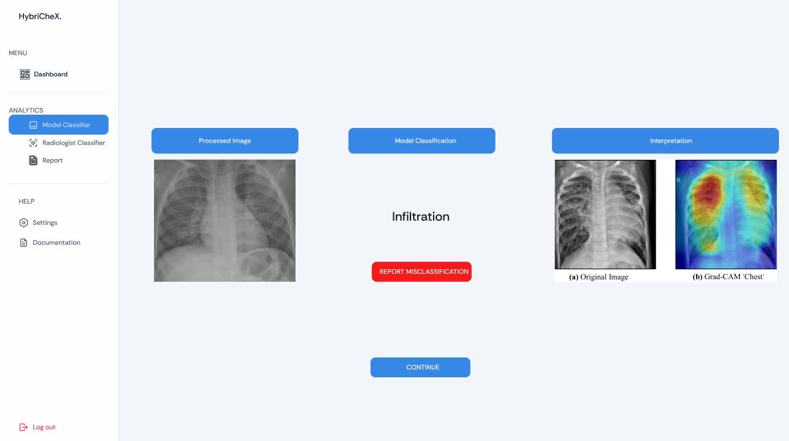
      </a>
       
      HybriCheX - Model Classifier
    </td>
  </tr>
</table>

---

### Low Light Image Enhancement

The [Low Light Image Enhancement](https://github.com/CureQ/LLIE) research investigated the extent to which low-light
 image enhancement (LLIE) techniques can contribute to
 the improvement of fall detection performance in dark environments
 within Alderli's existing system, an AI-supported
 fall detection system for vulnerable populations. Fall detection in
 poor lighting conditions poses a challenge for reliability
and safety, in part because of the limited quality
 of images produced by infrared cameras in dark
 situations. Several LLIE methods, both traditional and
 deep learning-based, have been evaluated for their effect on the
 performance of Alderli's fall detection model. Despite the fact that the deep
 learning models are suitable for an edge implementation and show
 potential at a low detection threshold, none of the
 LLIE techniques proved to be able to actually
improve the system at the stated requirement (a
 detection threshold of 0.5). In addition, it was investigated whether fine-tuning LLIE
models with Alderli's own data could lead to better performance,
 but this did not yield a desired improvement. The results
 suggest that under current conditions, including
 camera quality, amount of data and system architecture,
 LLIE does not provide a suitable solution. Further gains may be
 possible by improving the hardware and collecting a
 more representative data set.  Until then, gamma correction remains the
 most effective enhancement in dark conditions, but
 without offering an improvement on the original implementation.

<!-- LLIE images -->

  <a href="https://github.com/CureQ/LLIE">
    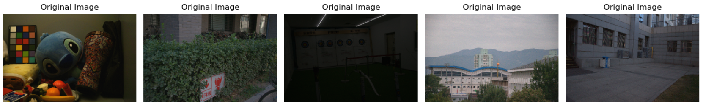
  </a>
   
  <a href="https://github.com/CureQ/LLIE">
    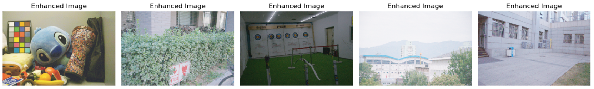
  </a>
   
  Low Light Image Enhancement - Examples

---

### Sleeping score

[Sleeping score](https://github.com/CureQ/Slaapscore)

<!-- Sleepscore images -->
<!-- Table Image styling for multiple images near eachother -->
<table>
  <tr>
    <td align="center" width=50%>
      <a href="https://github.com/CureQ/Slaapscore">
        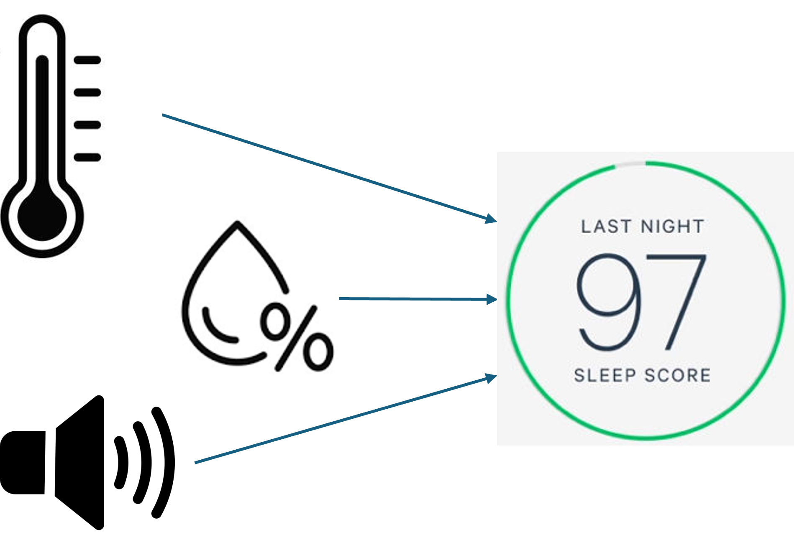
      </a>
       
      Sleepscore - Measurements & Calculation of final Sleep Score
    </td>
    <td align="center" width=50%>
      <a href="https://github.com/CureQ/Slaapscore">
        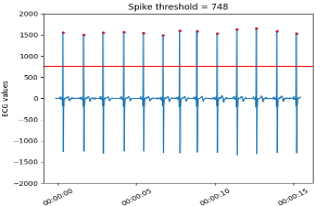
      </a>
       
      Sleepscore - Define Heartbeats from ECG data
    </td>
  </tr>
</table>

<table>
  <tr>
    <td align="center" width=50%>
      <a href="https://github.com/CureQ/Slaapscore">
        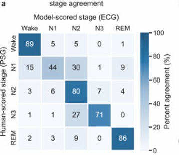
      </a>
       
      Sleepscore - Confusion Matrix of Predicted Sleep Stages
    </td>
    <td align="center" width=50%>
      <a href="https://github.com/CureQ/Slaapscore">
        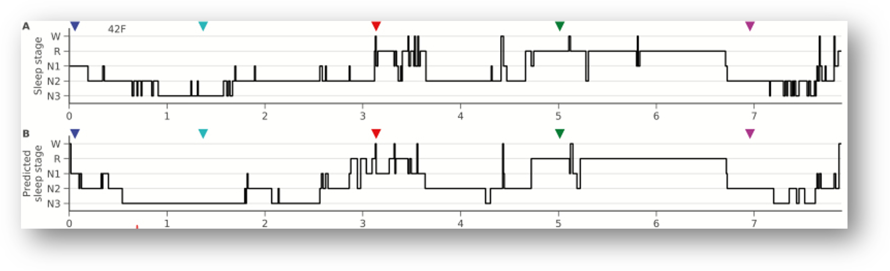
      </a>
       
      Sleepscore - Machine Learning Predicted Sleep Stages
    </td>
  </tr>
</table>

  

## AI-Lab assignments