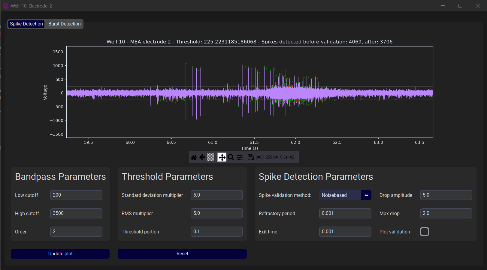
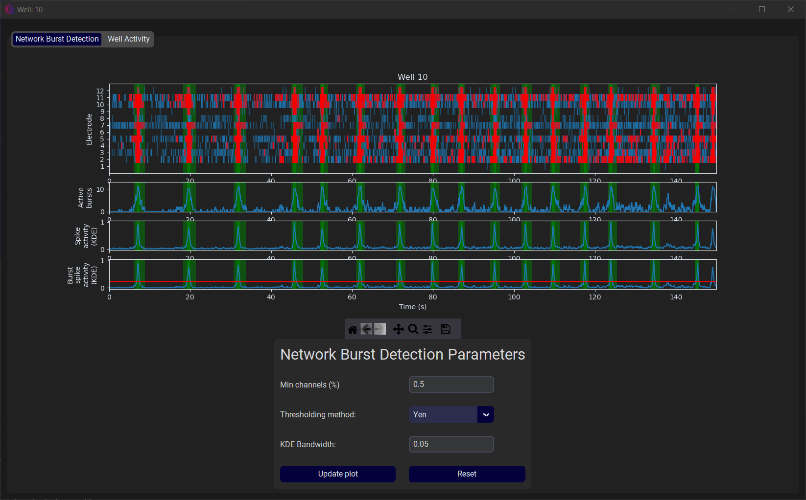
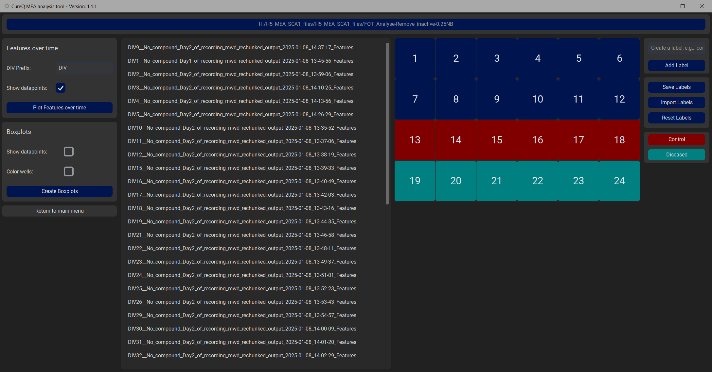
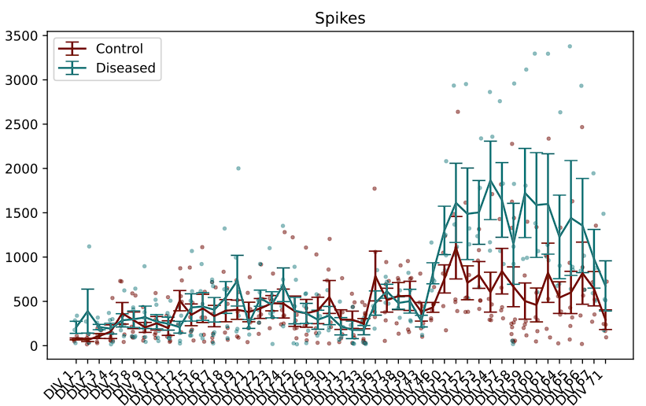
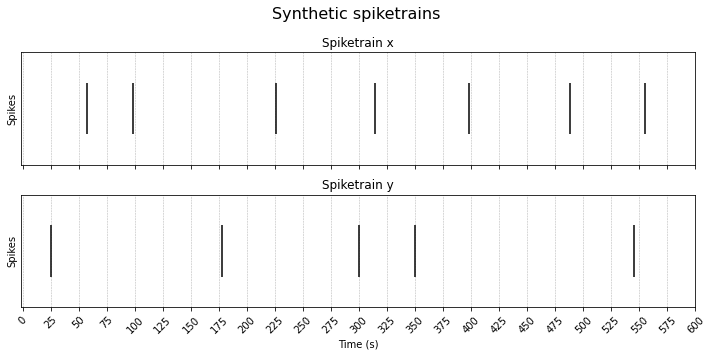
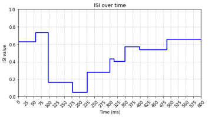
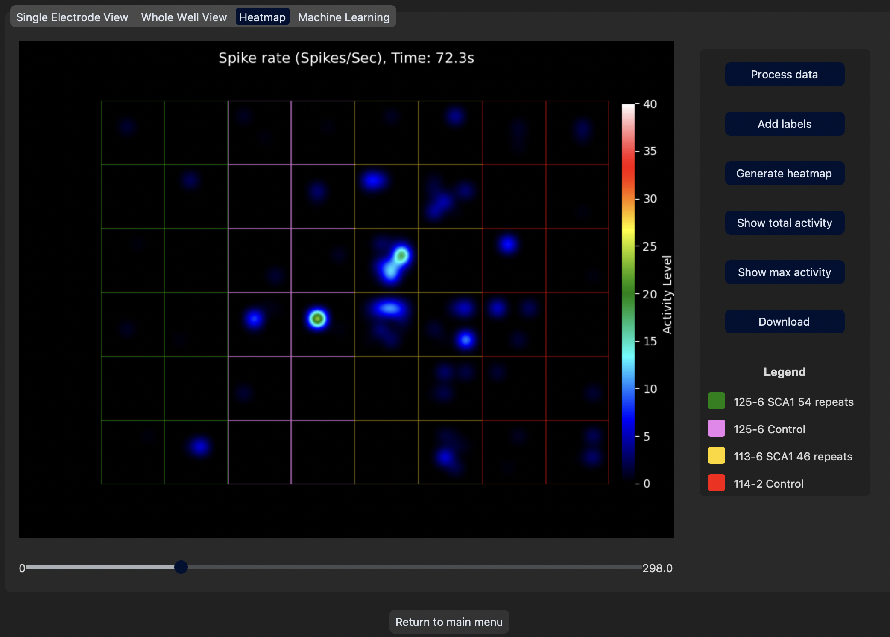
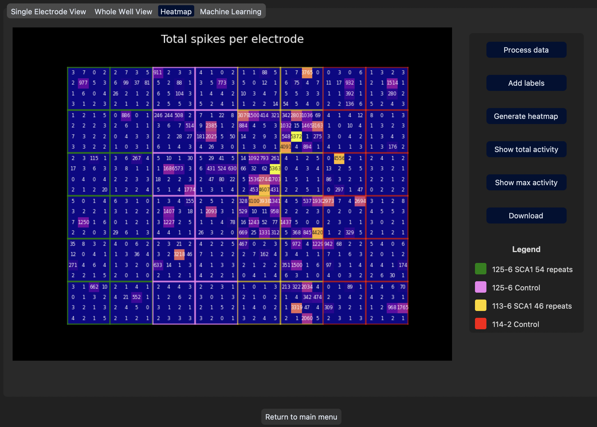
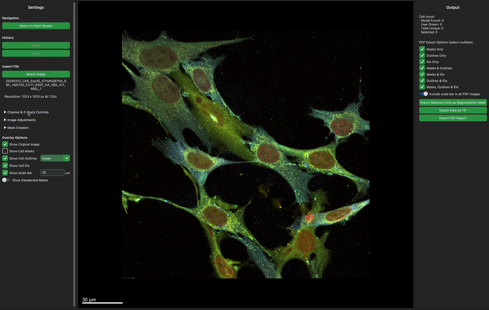
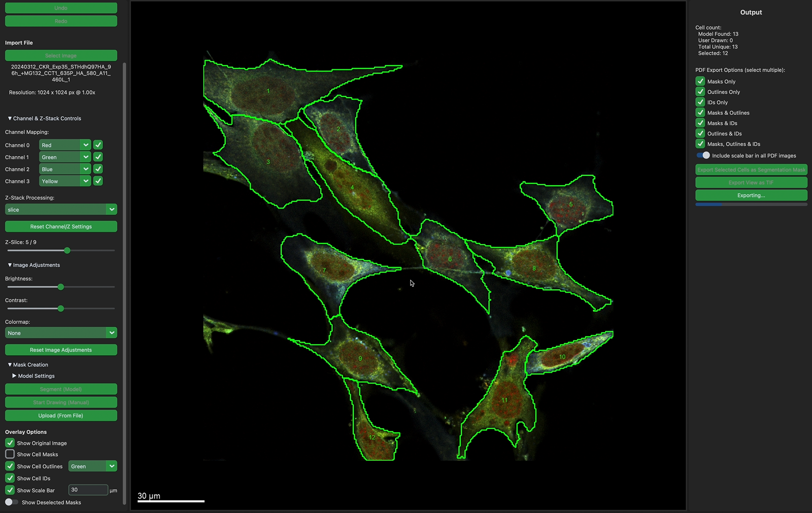

<!-- Image styling for multiple images near eachother -->

<!-- Subject

  

    
  <figcaption>Description</figcaption>
  

 -->

<!-- CureQ logo -->

# CureQ-Lab
This repository contains [libraries for the CureQ consortium](#cureq-projects) and [research projects of the AUAS CureQ Lab](#other-auas-projects), which are developed as part of the Applied Artificial Intelligence (AI) master thesis and the Biomedical Engineering (BMT) bachelor thesis at the Amsterdam University of Applied Sciences (HvA).

## CureQ projects

We have made <i>2</i> GUI's for projects regarding the CureQ consortium. 
1. The [MEAlytics GUI](#mealytics) performs analysis of the Micro-electrode Array (MEA) experiments.
2. The [Microscopy GUI](#microscopy) performs analysis of microscopy images.  

---

  

### MEAlytics

[MEAlytics](https://github.com/CureQ/CureQ) is a python package for analyzing Micro-electrode Array (MEA) experiments. This package offers high speed spike, burst and network burst detection followed by feature extraction.  The whole analysis tool is implemented in a Graphical User Interface (GUI). This GUI is used to inspect the raw MEA data and the analysis results. A few examples about the spike detection, burst detection and feature extraction can be found below &darr;

<!-- MEAlytics images -->

  

    
  <figcaption>MEAlytics - Spike Detection</figcaption>
  

  
  

    
  <figcaption>MEAlytics - Network Burst Detection</figcaption>
  

  

    
  <figcaption>MEAlytics - Group Comparison</figcaption>
  

  
  

    
  <figcaption>MEAlytics - Features over Time</figcaption>
  

The MEAlytics tool also has a few other extensions (branches), which has not yet been merged with the main branch. These projects are about a newly introduced [Synchronisation method](#synchronisation) and a [Spike heatmap & Machine Learning predictions](#spike-heatmap--machine-learning-predictions).

### Synchronisation

An extra feature for the MEAlytics tool is about [Synchronisation](https://github.com/CureQ/CureQ/tree/Luca_synchronisation) methods. Synchrony is the degree of connectivity between two electrodes based on how synchronized the activity is across these electrodes. Synchrony differs from the already existing <i>network bursts</i> feature from the MEAlytics tool, because the <i>network bursts</i> feature requires at least half of the electrodes in a well to be active and the network burst detection is often delayed or absent because of this strict requirement. 

A spike train is a sequence of all detected spikes from an electrode. Examples of two spike trains and the Inter Spike Interval between these two spike trains can be found in the images below &darr;

<!-- Synchrony explanation images -->

  

    
  <figcaption>Synchronicity - Synthetic Spike trains</figcaption>
  

  

    
    <figcaption>Synchronicity - ISI over time</figcaption>
  

### Spike heatmap & Machine Learning predictions

An other project for the MEAlytics tool consisted of the 2 features: [Spike heatmap & Machine Learning predictions](https://github.com/CureQ/CureQ/tree/Lucas). 

1. The [Spike heatmap frame](https://github.com/CureQ/CureQ/blob/Lucas/docs/heatmap.md) generates an animation of a well overview heatmap with the activity of each electrode. It is also possible to show a heatmap showing the total activity of each electrode, and a heatmap showing the maximum per second activity of each electrode.

<!-- Heatmap images -->

  

    
  <figcaption>Heatmap animation - Activity of each electrode</figcaption>
  

  
  

    
  <figcaption>Heatmap - Total activity of each electrode</figcaption>
  

 

2. There is also a second added frame in this branch, which is about the [Machine Learning predictions](https://github.com/CureQ/CureQ/tree/Lucas).

---

### Microscopy 

The [Microscopy GUI](https://github.com/CureQ/Microscopy) performs segmentation and statistical calculations on microscopy images.  The current main version provides the cell body detection application to analyze microscopy images and identify cell bodies in the provided samples.

The Microscopy tool also has a few other brances, which has not yet been merged with the main branch. These projects are about [Aggregate quantification](#aggregate-quantification) and [Colocalization](#colocalization).

<!-- Microscopy GUI images -->

  

    
  <figcaption>Microscopy GUI - Loaded microscopy image</figcaption>
  

  

    
    <figcaption>Microscopy GUI - Segmentated cell bodies</figcaption>
  

### Aggregate quantification

[Aggregate quantification](https://github.com/CureQ/Microscopy/tree/Aggregate_Detection/Aggregate_Detection)

### Colocalization

[Colocalization](https://github.com/CureQ/Microscopy/tree/Colocalization/Colocalization)

---

## Other AUAS projects

In our CureQ lab at the Amsterdam University of Applied Sciences (AUAS), we also have had some other projects, which are not CureQ related, but do have a subject relating to <i>Biomedical Technology</i> and <i>Artificial Intelligence (AI)</i>. These <i>4</i> projects are listed below.

### Cardiovascular Risk

[Cardiovascular Risk](https://github.com/CureQ/Cardiovascular-Risk)

### HybriChex

[HybriChex](https://github.com/CureQ/HybriChex)

### Low Light Image Enhancement

[Low Light Image Enhancement](https://github.com/CureQ/LLIE)

### Sleeping score

[Sleeping score](https://github.com/CureQ/Slaapscore)